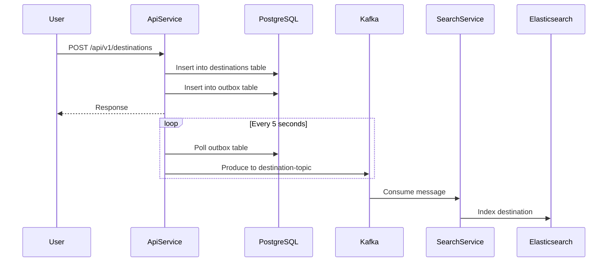

# Tourist Project

## Overview
The Tourist Project is a comprehensive microservices-based application designed to help users discover and plan their stays at various destinations. The system leverages modern technologies including Spring Boot, Kafka, Elasticsearch, and AI agents to provide an intelligent travel planning experience.

## Architecture

The project follows **Domain-Driven Design (DDD)** and **Onion Architecture** principles, consisting of multiple microservices and components.

### DDD Architecture

The system is organized around **two core domains**:

1. **Destination Domain**: Encapsulates all destination-related business logic and entities
2. **Outbox Domain**: Handles reliable message publishing with the transactional outbox pattern

These domains are shared across services, allowing **API Service** and **Search Service** to use the same `destination` domain. Each service implements only its own **Application** and **Infrastructure** layers:

- **API Service**: Implements Application and Infrastructure layers for both `destination` and `outbox` domains
- **Search Service**: Implements Application and Infrastructure layers only for the `destination` domain (read-only)

This approach promotes code reuse while maintaining clear service boundaries and responsibilities.

### Core Application
The main application is structured as a multi-module Maven project with the following services:

#### **API Service**
- Main REST API for destination management
- Implements Outbox pattern for reliable event publishing (merged from standalone Outbox Service)
- Polls the outbox table periodically to ensure reliable message delivery to Kafka
- Uses PostgreSQL for persistence
- Exposes endpoints for creating and managing destinations
- Handles both destination domain logic and outbox domain logic

#### **Search Service**
- Consumes destination events from Kafka
- Indexes destinations in Elasticsearch
- Provides advanced search capabilities
- Uses shared destination domain but implements its own read-focused infrastructure

#### Event Flow


### Infrastructure Components
- **PostgreSQL**: Primary data store for destinations and outbox
- **Kafka**: Event streaming platform for inter-service communication
- **Kafka UI**: Management interface for Kafka topics
- **Elasticsearch**: Search engine for destination indexing

## AI Integration

The project includes an advanced AI component that is currently under development:

### **AI Agent**
- Spring Boot application providing intelligent chat capabilities
- Integrates with **WhatsApp** through webhook controllers
- Uses MCP (Model Context Protocol) client for tool integration
- Core chat functionality and WhatsApp service integration
- Will be deployed in future releases

### **MCP Server Tourist**
- Model Context Protocol server implementation
- Provides AI-powered destination query tools
- Acts as a bridge between the AI agent and the destination API
- Exposes destination data in a format consumable by AI models

### **MCP Server Weather**
- Additional MCP server for weather information
- Provides weather data for destinations

## Deployment

The application is deployed using **Docker Compose** on **AWS Elastic Beanstalk**:

### Docker Compose Architecture
All services are containerized and orchestrated using Docker Compose:
- API Service (includes outbox polling functionality)
- Search Service
- MCP Server Tourist
- AI Agent

### Deployment Strategy

#### Option 1: Single Instance (No ALB)
- Uses *beanstalk-no-alb* configuration
### Deployment Strategy

#### Single Instance Deployment
- Single instance deployment for cost efficiency
- Suitable for development and testing environments

#### Production Deployment
- Application Load Balancer for high availability
### Container Registry
All Docker images are hosted on **GitLab Container Registry** with proper versioning and CI/CD integration.

### AWS Configuration
- **Region**: Europe (Paris)
- **Platform**: Docker on Amazon Linux 2023
- **Infrastructure**: VPC with multiple availability zones for redundancy
## Technology Stack

### Backend
- **Java** with Spring Boot 3.5.0
- **Spring Data JPA** for persistence
- **Apache Kafka** for event streaming
- **Maven** for dependency management

### Data Storage
- **PostgreSQL 15** - Relational database
- **Elasticsearch** - Search engine

### Infrastructure
- **Docker & Docker Compose** - Containerization
- **AWS Elastic Beanstalk** - PaaS deployment
- **Nginx** - Reverse proxy (in production)

### AI & ML
- **Model Context Protocol (MCP)** - AI tool integration
- **Spring AI** - AI capabilities integration
- **WhatsApp Business API** - Conversational interface

## Development

### Local Setup
```bash
# Start infrastructure
## Development

### Local Setup
The project uses Docker Compose for local development environment setup, making it easy to spin up all required services and dependencies with a single command.

### API Example
The REST API allows creating and managing destinations with detailed information including name, type, description, address, and location data. Core microservices architecture
- ✅ Event-driven design with Outbox pattern
- ✅ Elasticsearch integration
- ✅ Docker Compose deployment

### Phase 2 (In Progress)
- 🔄 AI Agent development
- 🔄 MCP Server implementation
- 🔄 WhatsApp integration

### Phase 3 (Planned)
- 📋 AI Agent deployment to production
- 📋 Enhanced destination recommendations
- 📋 Multi-language support
- 📋 Advanced search filters

## Key Features

1. **Domain-Driven Design**: Shared domains (destination and outbox) across services with independent Application/Infrastructure layers
2. **Reliable Event Processing**: Outbox pattern integrated into API Service ensures no events are lost
3. **Advanced Search**: Elasticsearch-powered destination discovery
4. **AI-Powered Assistance**: Conversational interface for trip planning (coming soon)
5. **Cloud-Native**: Containerized and ready for cloud deployment
6. **Scalable Architecture**: Microservices design with clear domain boundaries allows independent scaling
7. **Production-Ready**: Deployed on AWS with proper infrastructure

## Status
- **Core Application**: ✅ Production-ready and deployed
- **Search Service**: ✅ Operational
- **AI Components**: 🔄 Under development, deployment pending